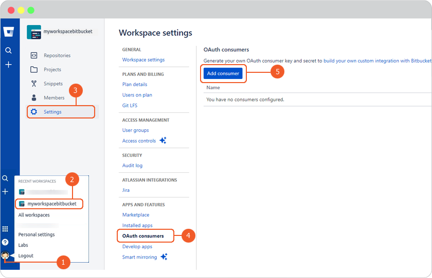
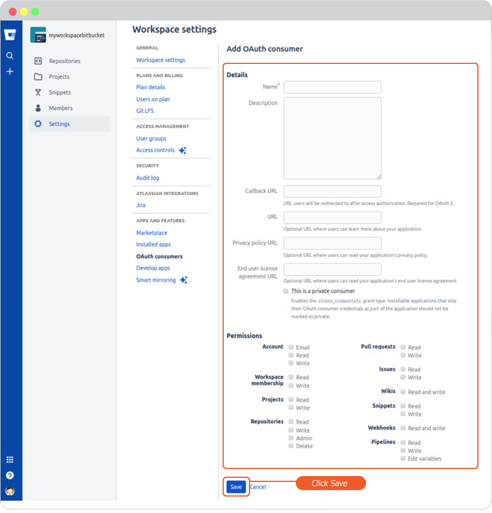
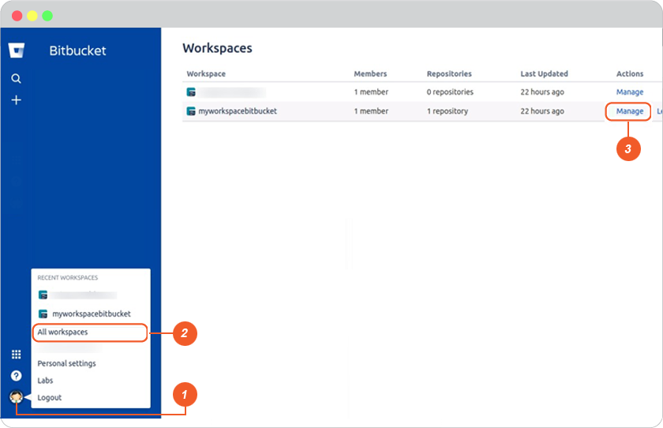
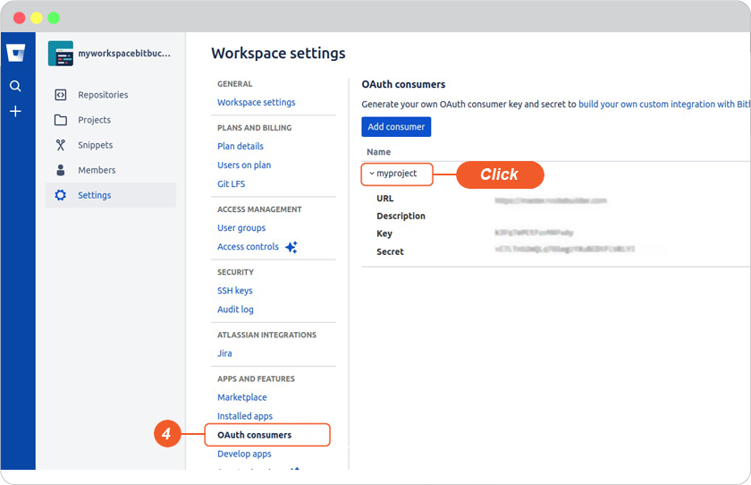
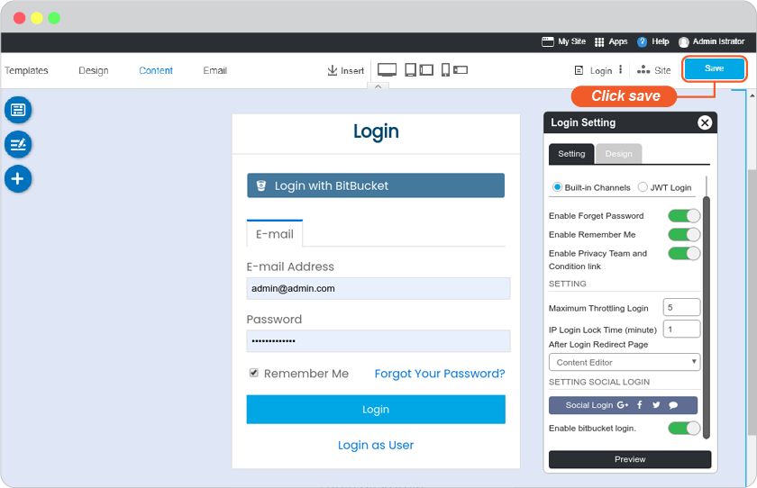

# Bitbucket Login Setup

Setup requires a Bitbucket membership and a Bitbucket OAuth consumers.

## Creating a OAuth consumers

OAuth needs a key and secret, together these are know as an OAuth consumer. You can create a consumer on any existing workspace. To create a consumer, do the following:

1. Sign in at <https://Bitbucket.com/> , or register if you don't have Bitbucket account.
2. From your profile avatar in the bottom left, click on the workspace in the **Recent workspaces** list or click All workspaces to open an entire list from which to choose.
3. Click **Settings** on the left sidebar to open the Workspace settings.
4. Click **OAuth consumers** under Apps and features on the left navigation.
5. Click the **Add consumer** button.

    

6. Add OAuth consumer, Click Save. The system generates a key and a secret for you.

    

7. Toggle the consumer name to see the generated Key and Secret value for your consumer.

    

## Once you have Bitbucket OAuth consumers, you can set up Login as Bitbucket as follows

1. Sign in at <https://Bitbucket.com/>.

2. In the bottom left sidebar, click your profile and setting, then click **All workspaces**.

3. Click **Manage** your consumer.

    

4. Click **OAuth consumers** under APPS AND FEATURES group on the sub navigation, then click the consumer name to see the generated Key and Secret value for your consumer.

    

5. Go to website editor -> Site -> System -> on "System Pages" list -> Login, click on Login form to open Login setting. On Login Setting panel, scroll and click "Social Login" button, you will be at "Site Config" Member.

   1. Select Bitbucket tab.
   2. Insert App ID for Bitbucket Client ID and App Secret for Bitbucket Client Secret.
   3. Click Save to add these values to your form.
   4. Close the Site Config window.

    

   5. Click **Save** in the editor page.

    

6. The Bitbucket Login single sign-on is available for your user to login to your website without make a new register.

**Bonus**

Disable and Enable your Bitbucket Login

Go to website editor -> Site -> System -> on "System Pages" list -> Login, click on Login form to open Login setting. On Login Setting panel, scroll and look at **Enable bitbucket login**.

A.  slide to to left to disable or right to enable.

B.  Click "Preview".

C.  Click "Save" to save all of your setting.

