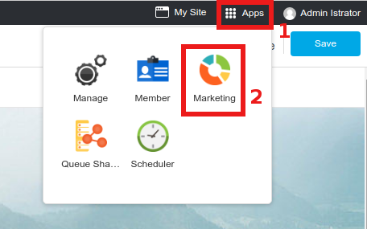
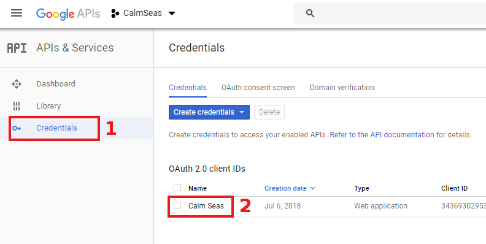

# Google API

-   [Google API Setup](#google-api-setup)

Google API Setup is needed when for google connection for your website performance and setting up website register & login from Single Sign-on with users google email account.

Once you setup [SEO and Meta tag](https://github.com/rvsitebuilder/user-docs/blob/7.1/en/easy-website-seo.md) for your website already. You can see website performance and how SEO works on Google Console.

Aside from loggin to Google Console, RVsitebuilder 7 can bring those report in your website admin area by setting Google API.

As above, to see your website report from Google Console, you can first set Google API with by this guide.

## Google API Setup

1. Register at https://console.developers.google.com/

2. In Google APIs page, click **Create** for setting your new Google API.

3. Insert your Project Name, and click **Create**.

4. Once the new project has been created, at Google APIs select your created project and click **Credential**.

5. In Create credentials drop-down list, select OAuth client ID

6. Then, select **Configure consent screen**.

7. Create your **Product name shown to users** and website URL at **Homepage URL**.

For example: Product name shown to users : Calm Seas
Homepage URL : http://calmseas.netwaysite.com/

8. At **Create OAuth client ID** page.

1) Select **Web application**
2) Create a name for recognizable
3) Insert **Authorized JavaScript origins** (Your website URL)
4) Insert **Redirect URL\***
   _Please login to your website admin, go to Marketing -> Go to Setup to bring the value for Redirect URL information._
5) Don't forget to click **Save**.

9. The **Client ID** and **Client Secret** are showing that you can copy before leaving this page by clicking **OK**.

10. Once you clicked OK to leave OAuth client, at Google APIs page , select **Library**.

11. Search for the following API setups to **Enable** them.

Click **_Enable_** to activate the API.\*

12. Login to your website admin, go to **Apps** -> **Marketing** -> **Go to Setup** to insert **Client ID** and **Client Secret** form number 9.

Then click **Create Google Authorization**.
_(You can find details from number 9 at Google API, menu Credential, click on the created project.)_

13. Once the detail are are successfully submitted, you will be leased to Google Login page.
    Select account you want to use for Google Analytics setup for your website.

14. Allow Google to access by clicking **ALLOW**.

15. Once the setup completed, you will see **Google API Setup** page.

-------------------------------------------------------------------------
