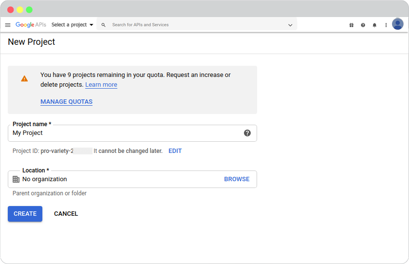
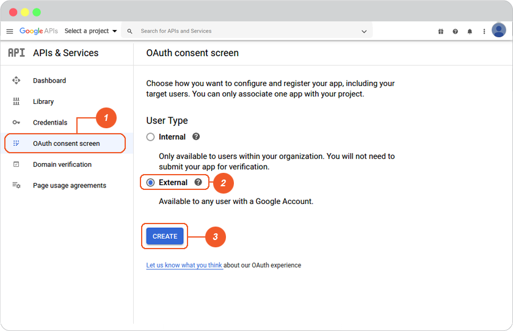
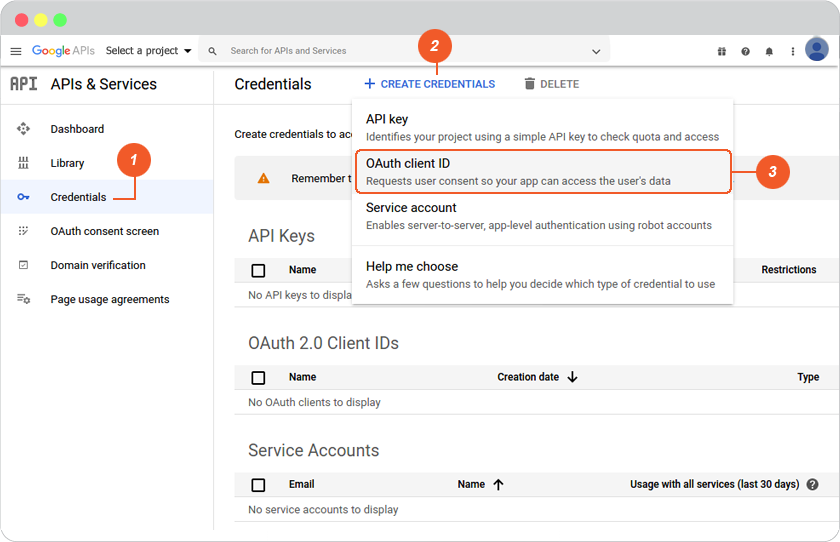
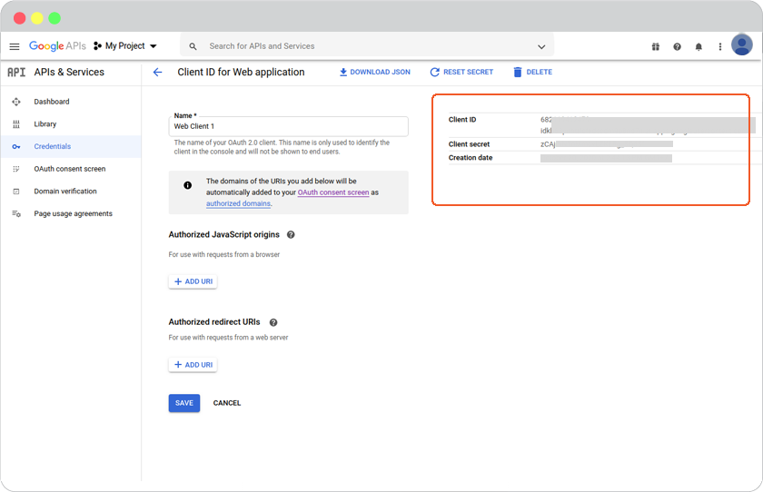

# Google Login Setup

You can set up social connections for applications using the Google API Setup. The configured social connections can be used to log in to your application.

To learn how to use [OAuth 2.0](https://support.google.com/cloud/answer/6158849/)

**Google Login Setup for Built-in Channels requires Google API Setup**. Don't worry if you don't feel familiar with Google API Setup, you can follow easy steps below.

1. Open Google Console website at <https://console.developers.google.com/> . Login with your google email (Gmail) or register if you don't have one.

2. **Create Project Name.** On the top menu bar, click "Select a project", then click "NEW PROJECT".

3. Create a new project for your domain, click "CREATE".

4. **Create OAuth Consent Screen.** On the left, click "OAuth consent screen", click "External", then click "Create".

5. Register for 4 STEPS.

6. **Create Client ID for Web application.** On the left, click "Credentials", click "+CREATE CREDENTIALS", then select "OAuth Client ID".

7. Create OAuth client ID, select "Application type" (Web application), create OAuth Client Name, then click "CREATE".

8. **To check.** Click "Credentials", click your OAuth Client Name.

9. On the page that appears, copy the client ID and client secret to your clipboard, as you will need them when you configure your client library.

10. Go to website editor -> Site -> System Pages -> Login, click on Login form to open Login setting. Enable Google Login Setup.

     1. Select google tab.
     2. Insert Client ID and Client secret from number 9 to Google Login Setup, and click OK to complete setting.
     3. Click OK to add these values to your form.

    

     4. On Login Setting, click open switch button.
     5. Click "Preview"
     6. Click "Save" to save all of your setting above.

    

11. The Google Login single sign-on is available for your user to login to your website without make a new register.

If Google Login returns error when visitors try to login, please contact your host provider to allow google rule_id in ModSecurity by this [guide](https://support.rvglobalsoft.com/hc/en-us/articles/360019136994-Google-Login-on-My-website-is-giving-error-when-visitors-try-to-login-).
