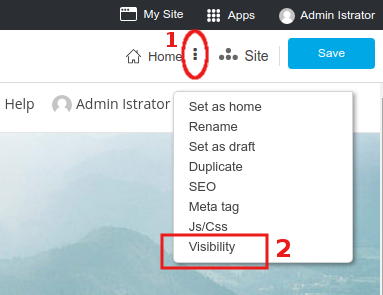
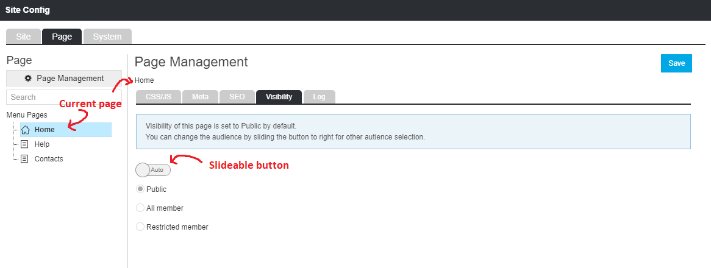
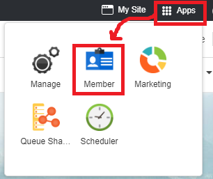

# Page Visibility and Website Membership

## Page Visibility

### Meaning
Page visibility is the feature to set to whom your page(s) will be visible to, public, all members, or restricted members.

**Public**, is the default visibility for every page you added in your website. The Public is meant to allow everyone who open the page to be able to see the content.

**All members**, is the custom visibility you can define to any page in your website. It will allow ONLY MEMBERS who registered on your website can see the content of this page by logging in with their registered username and password.

**Restricted member(s)**, is the custom visibility you set for restricted members who have more privilege than normal members such as to be able to access to website admin area. The advanced privilege of these restrictd members will be set by you (will be explained in Website Membership part).

#### Setting Areas
- 3-dot next to current page name you're editing

- Site -> Page Management icon

- Site -> Menu Pages -> 3-dot after page names

#### Page Visibility Management

Once **Visibility** clicked, you will be at Page Management box.

- **Menu Pages** on the left colum will bluely highlight the current page that you're going to set its visibility now. You can change to other pages from here to set their visibilities.

- **Page Management** with current page name on the right column. The slideable button will be shown as "Auto" with colorless which it's telling that the visibility of THIS PAGE is automatically set to PUBLIC. 

Slide this button to right, and select one audience type for this page.

## Website Membership

At the current page editor, click on **Apps**, selct **Member** to open Member management area.

### User Management

All website members, you, other website admins, and those customers who registered on your website will be listed here.

#### Edit Current Member
You can edit password, enable the member to login by single sign-on from their socials accounts (Gogle Email, Facebook, Twitter, LINE), personal information, and roles , or delete member.

1. Click the name you want to edit.
1. In the member information page, edit fields you want. 
1. Click **Update** button for saving.

