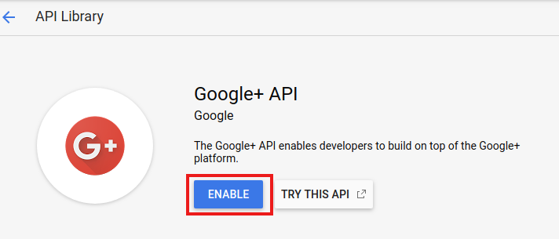

# Register and Login System

To​ allow​ website​ visitor​s​ to​ register​ in​ your​ website​ as​ a​ member for​ purpose such​ as​ some​ privilege page​ access​ or​ some​ part​ of​ website​ admin​ interface for​ some​ exclusive​ users,​ you can​ activate​ the​ Built-in Login​ System​ to​ allow​ users to​ use​ their​ current​ account​ from​ **Google​ Email, Facebook, Twitter, LINE**, and​ also​ the​ direct register​ with​ their​ email​ address​ is​ support​ed.

## Activate Google for register and login system

Google Login Setup for Built-in Channels in your website

Google Login Setup for Built-in Channels requires Google API Setup. Don't worry if you don't feel familar with Google API setup, you can follow easy setup below.

1. Open Google Console website at https://console.developers.google.com/ . Login with your google email (Gmail) or register if you don't hace one.

2. In Google APIs page, click **Create** for setting your new Google API.

3. Insert your Project Name, and click **Create**.

4. Once the new project has been created, at Google APIs select your created project and click **Credential**.

5. In Create credentials drop-down list, select OAuth client ID

6. Then, select **Configure consent screen**.

7. Create your **Product name shown to users** and website URL at **Homepage URL**.

For example: Product name shown to users : Calm Seas
Homepage URL : http://calmseas.netwaysite.com/

8. At **Create OAuth client ID** page.
1) Select **Web application**
2) Create a name for recognizable
3) Insert **Authorized JavaScript origins** (Your website URL)
4) Insert **Redirect URL***
*Please login to your website admin, go to Marketing -> Go to Setup to bring the value for Redirect URL information.*
5) Don't forget to click **Save**.

9. The **Client ID** and **Client Secret** are showing that you can copy before leaving this page by clicking **OK**.

10. Once you clicked OK to leave OAuth client, at Google APIs page , select **Library**.

11. Search for the following API setups to **Enable** them.

Click ***Enable*** to activate the API.*

At Google Developer Console page, click Credentials.

Select OAuth Client ID you created from number 1.

Google Developer Console page will display Client ID and Client secret.

Login as admin to your website.

Go to website editor -> Site -> System Pages -> Login, click on Login form to open Login setting. Enable Google Login Setup.

Insert Client ID and Client secret from number 8 to Google Login Setup, and click OK to complete setting.
 

If Google Login returns error when visitors try to login, please contact your host provider to allow google rule_id in ModSecurity by this guide. 

##​Facebook Login Setup for Built-in Channels in your website

Go to https://developers.facebook.com/apps , select Create a New App.

Insert Display Name and Contact Email you want facebook to connect with your website. Then click Create App ID.

Insert the correct Security Check.

Next page, look for product Integrate Facebook Login and select Confirm.

At Facebook API management dashboard, find Facebook Login, and insert OAuth redirect URIs and Save Changes. (You can find OAuth redirect URIs in your website editor -> Site -> System Pages -> Login, click on Login form to open Login setting, look for Login Callback URL for facebook.)

Go to Settings -> Basic, to insert Privacy Policy URL. If you have a page to provide Privacy Policy on your website, if not, you can insert your website URL.

Select + Add Platform to continue.

Select Platform as Website.

Insert your website at Site URL and click Save Changes.

Next page, set the Status as On.

Confirm the setting.

Look for App Secret, and select Show.

Facebook API management page will display App ID and App secret.

Login as admin to your website.

Go to website editor -> Site -> System Pages -> Login, click on Login form to open Login setting, to enable Facebook Login Setup.

User the data of App ID and App secret from number 13 to insert at Facebook Login Setup.
