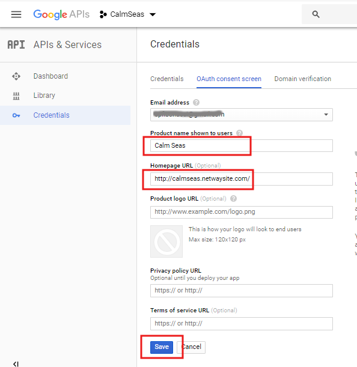
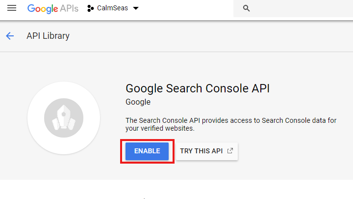
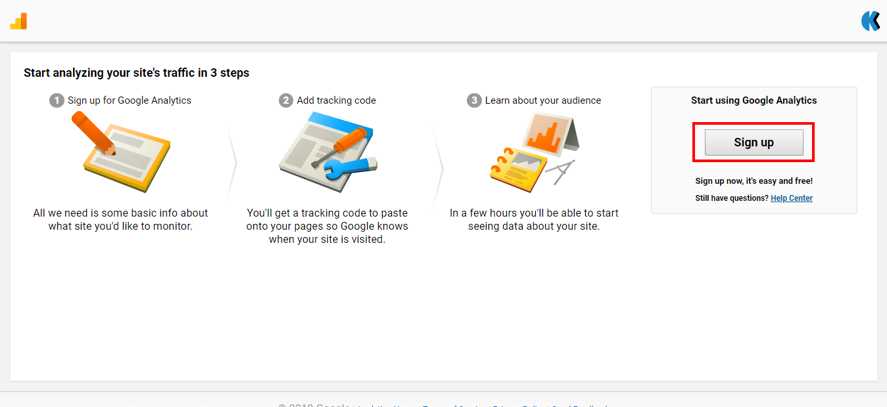
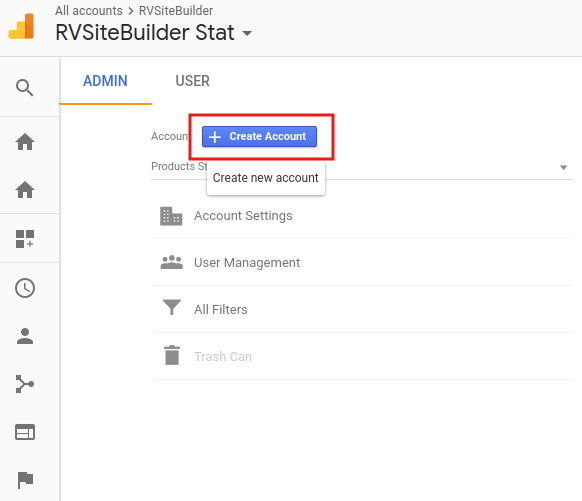
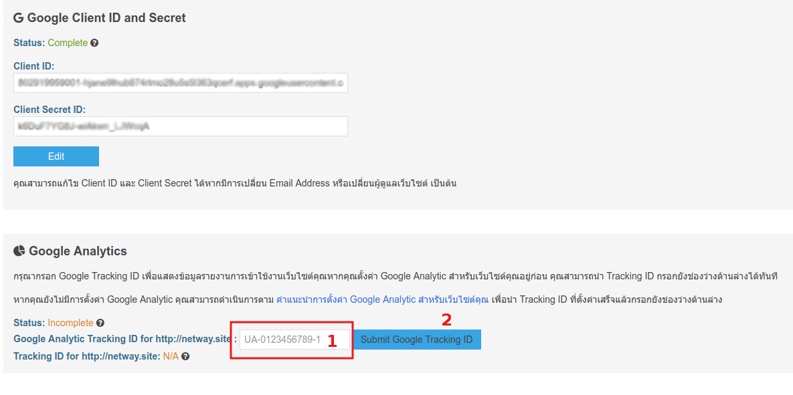

# Website Marketing

## Google API

Once you setup [SEO and Meta tag](https://github.com/rvsitebuilder/user-docs/blob/7.1/en/easy-website-seo.md) for your website already. You can see website performance and how SEO works on Google Console.

Aside from loggin to Google Console, RVsitebuilder 7 can bring those report in your website admin area by setting Google API.

As above, to see your website report from Google Console, you can first set Google API with by this guide.

### Google API Setup

1. Register at https://console.developers.google.com/ 

2. In Google APIs page, click **Create** for setting your new Google API.

3. Insert your Project Name, and click **Create**.

4. Once the new project has been created, at Google APIs select your created project and click **Credential**.

5. In Create credentials drop-down list, select OAuth client ID

6. Then, select **Configure consent screen**.

7. Create your **Product name shown to users** and website URL at **Homepage URL**.

For example: Product name shown to users : Calm Seas
Homepage URL : http://calmseas.netwaysite.com/

8. At **Create OAuth client ID** page.
1) Select **Web application**
2) Create a name for recognizable
3) Insert **Authorized JavaScript origins***
4.1) Insert **Callback URL for MKT Setting*** (Enter or click Create to add another field for 4.2)
4.2) Insert **Callback URL for Social Login***
*Please login to your website admin, go to Marketing -> Go to Setup to bring the value for inserting 3, 4.1 and 4.2.*
5) Don't forget to click **Save**.

9. The **Client ID** and **Client Secret** are showing that you can copy before leaving this page by clicking **OK**.

10. Once you clicked OK to leave OAuth client, at Google APIs page , select **Library**.

11. Search for the following API setups to **Enable** them.

1) Analytics API
2) Google Analytics Reporting API
3) Google Search Console API
4) Google+ API
5) ite Verification API
*Sameple: Google Search Console API*

*Click ***Enable*** to activate the API.*

12. Login to your website admin, go to **Apps** -> **Marketing** -> **Go to Setup** to insert **Client ID** and **Client Secret** form number 9.

Then click **Create Google Authorization**.
*(You can find details from number 9 at Google API, menu Credential, click on the created project.)*

13. Once the detail are are successfully submitted, you will be leased to Google Login page.
Select account you want to use for Google Analytics setup for your website.

14. Allow Google to access by clicking **ALLOW**.

15. Once the setup completed, you will see **Google API Setup** page.

-------------------------------------------------------------------------

## Google Analytics

Here's the guide to set Google Analytics to see your website performance.

### Google Analytics Setup

1. Register with Google Analytics at https://www.google.com/analytics/. If you have account with Google Analytics for your previous website, you can use it without going for new register.

2. Once registration is completed, click on Gear icon for setting.

3. At setting page, click **Create Account** (It will automatically show *Create new account* page for new register account.)

4. At *Create new account* page, click **Website**, and fill the required details.

5. Then select **Get Tracking ID**.

6. Accept Google Analytics Terms of Service by **I Accept** button.

7. The **Tracking ID** of your website is now ready to use.

8. Connecting Google Analytics report of your website to show in your website admin area, at Marketing dashboard:

8.1) Login to your website, go to **Apps** -> **Marketing** -> **Go to Setup**.

8.2) Insert **Tracking ID** from number 7 in **Google Analytics** field, and click **Submit Google Tracking ID**.
*If you can't see the field to insert Tracking ID, you will have to go to setup Google API first.*

-------------------------------------------------------------------------

## Google Search Console

Google Search Console will monitor search result of your website on search engine such as google.com to let you analyse your SEO for the best solution.

You can bring these results to show on your website admin at Marketing dashboard by setup Google API first.

If Google API setup is completed,these following results will be shown on your website admin at Marketing dashboard.

Marketing -> Acquisition -> SEO

Marketing -> Acquisition -> Web referral

Marketing -> Performance -> Page speed

Marketing -> Performance -> Crawl errors

Marketing -> Performance -> robots.txt

Marketing -> Users -> User Analytic

-------------------------------------------------------------------------

